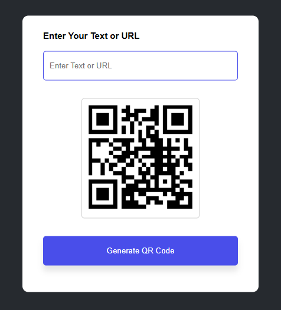

---

# QR Code Generator Web App

A simple web application that allows users to generate QR codes from text or URLs. Built with basic **HTML**, **CSS**, and JavaScript.

---

## Features

- Enter any text or URL to generate a QR code.
- Dynamically displays the QR code upon generation.
- Provides a clean and user-friendly interface.

---

## Demo Screenshot



---

## Installation & Usage

1. **Clone or Download the Repository:**
   - Clone:  
     ```bash
     git clone <repository_url>
     ```  
   - Or download the `.zip` file and extract it.

2. **Open the Application:**
   - Open the `index.html` file in your browser.

3. **Generate a QR Code:**
   - Enter text or a URL into the input field.
   - Click the **"Generate QR Code"** button.
   - The QR code will appear below the input field.

---

## Files Overview

- **index.html**: The main HTML structure of the application.
- **style.css**: Styling for the application (add custom CSS here).

---

## Dependencies

This app uses a free API for QR code generation:
- [QR Code Generator API](https://goqr.me/api/)

---

## Future Improvements

- Add the ability to download QR codes.
- Provide customization options for QR code size and color.
- Improve error handling and add animations.

---
